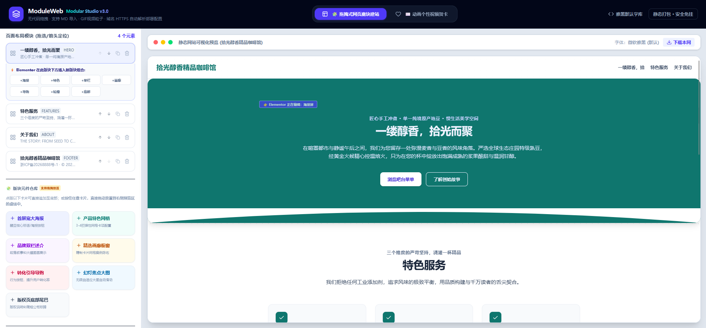

# ModuleWeb - 可以通过可视化模块化制作简单的静态网站和简单的贺卡  （也可以通过提示词来生成）

## Run Locally

**Prerequisites:**  Node.js

## 本地电脑上面进行构建代码：

1. Install dependencies:
   'npm install'
2. 'npm run build'
   如果出错，就上面的命令换成 'npm install --legacy-peer-deps'

### 然后，将生成的dist目录上传到服务器上面进行部署HTML项目就可以了。
